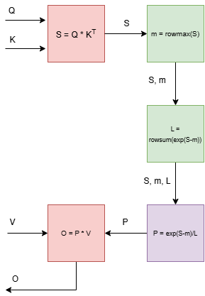
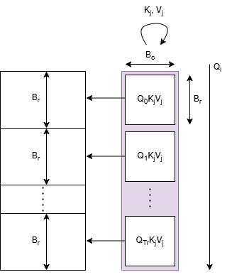
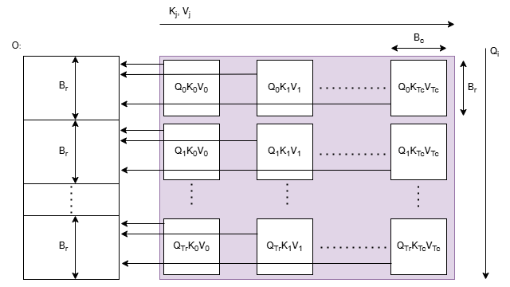

# FlashAttention - A CUDA Implementation

## Links
Presentation available here: [drive](https://drive.google.com/drive/folders/1fwwnjseEuscZfxMmxOfRifxoUyahRM2M?usp=drive_link)

Report available here: [report](E4750_2024Fall_Project_CUDA_ds4399_pkk2125_report.pdf)

## Why?
The time and memory complexity of self-attention mechanisms in transformers is quadratic with respect to sequence length, which makes them slow and demanding in terms of memory when processing long sequences. To address this issue, various approximate attention techniques have been proposed to reduce computational costs, but they often fail to deliver significant improvements in real-time performance. A crucial element often overlooked is making attention algorithms aware of input/output (I/O) operations—specifically, considering the reads and writes between different levels of GPU memory.
FlashAttention is an I/O-ware exact algorithm that reduces the number of reads and writes between GPU on-chip memory and HBM.


## Optimizations

Kernel Includes standard optimizations like memory coalescing, shared memory loading, to optimizes access. We also experiment with grid level optimizations by exploring different methods of tiling and computation with grids.

### Naive

<div style="display: flex;"> <div style="flex: 30%;">  </div> <div style="flex: 50%; padding-left: 10px;"> <p> Computations are serialized as shown. Each operation is executed as a kernel. 
While this approach is straightforward and relatively easy to implement, many computations made can be resued for more optimal execution.</p> </div> </div>


### 1D Kernel

<div style="display: flex;"> <div style="flex: 20%;">  </div> <div style="flex: 50%; padding-left: 10px;"> <p> Tiles of Q,O are loaded along corresponsing row in the 1D rgrid as shown in the figure. Each block loops over all tiles of K, V and performs update on output tile O.</p> </div> </div>

### 2D Kernel

<div style="display: flex;"> <div style="flex: 40%;">  </div> <div style="flex: 10%; padding-left: 10px;"> <p> Tiles of Q, O are loaded matching blockIdx.y and K,V are loaded matching blockDim.x. Each row in the grid performs update on the same output tile. Serialization happens in consecutive kernel execution; needed to compute global row max values. It was neccessary because grid synchronization primivites are not supported by PyCUDA. </p> </div> </div>


```
Directory structure:

├── 1DGrid (code for 1D kernel)
│   ├── 1dgrid.cu (kernels)
│   ├── funcs.cu (misc funcs)
│   └── funcstest.py (test)
├── 2DGrid
│   ├── attention.py 
│   ├── flashforward.cpp (kernels)
│   ├── flashforward.cu (kernels)
│   ├── resource_requested.py (util to check resources)
│   └── test_forward.py (test execution)
├── README.md
├── assets
│   ├── 1D_blocks.png
│   ├── 2D_blocks.png
│   └── Simple_Pipeline.png
├── figs (Analysis)
│   ├── cpu_naive_fixed_N.pdf
│   ├── cpu_naive_fixed_N_nonlog.pdf
│   ├── cpu_naive_fixed_d.pdf
│   ├── cuda_compare.pdf
│   ├── cuda_compare_fixedN.pdf
│   ├── cuda_compare_log.pdf
│   └── cuda_compare_log_fixedN.pdf
├── gemm_utils (Matmul kernels)
│   ├── matmulKernels.cpp
│   └── testmatmul.py
├── misc (misc suppport code and doc)
│   ├── FlashAttention_Reference_Paper.pdf
│   ├── test.py
│   ├── testglobalsync.py
│   └── utils.py
├── naiveKernel (naive implementation)
│   └── simple.cu
└── utils
    ├── compareKernels.py
    ├── device_properties.py
    ├──...

```

### Running Scripts

To run relevant kernel scripts, please go to each directory and execute test python files using CLI.

